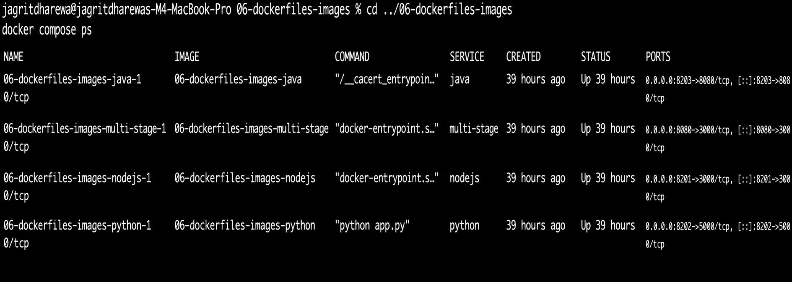
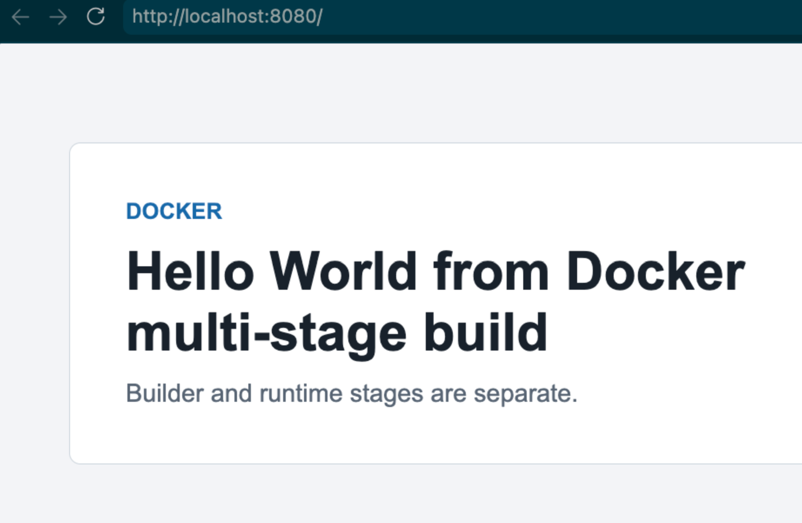

# Multi-Stage Evidence

Name: Jagrit Dharewa

Roll number: **10642**

## Result

- The image built with two stages.
- The page showed `Hello World from Docker multi-stage build`.
- The container used host port `8080`.
- The container list and browser result are saved as screenshots in the parent folder.

## Screenshots

